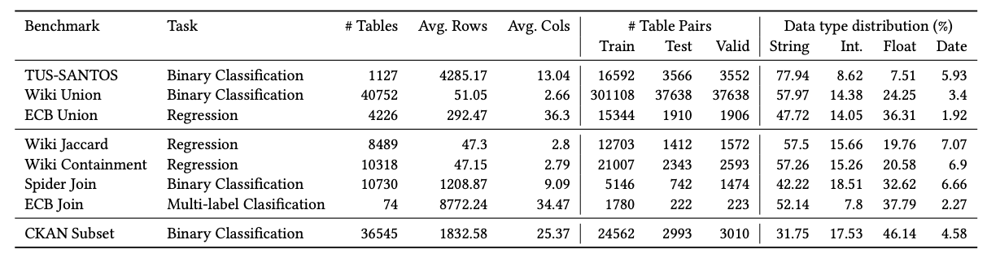

# TabSketchFM


<p align="center">
    <a href="https://ibm.github.io/tabsketchfm">🏠 Homepage</a> •
    <a href="https://arxiv.org/abs/2407.01619">📄 Paper</a>
    <!-- <a href="https://huggingface.co/datasets/ibm/ACPBench">🤗 Dataset</a> -->
</p>
<p align="center">
    <a href="#-getting-started">🔥 Getting Started</a> •
    <a href="#-license">✋ License</a> •
    <a href="#-citation">📜 Citation</a>
</p>

This repo contains code for the paper titled **TabSketchFM: Sketch-based Tabular Representation Learning for Data Discovery over Data Lakes**. 

## 🔥 Getting Started

1. Create and activate a virtual environment for this project  

      ```
      python3 -m venv tabsketchfm_env
      source tabsketchfm_env/bin/activate
      which python
      ```
      
2. Fork the code and install necessary packages in the [requirements.txt](./requirements.txt)
   ```
   pip install -r requirements.txt
   ```


3. Pretraining

    a. Preprocess the opendata for faster training

    Preprocess the opendata files for pre-training


    ```
    # path to the directory with tables to be used for pretraining
    DATA_FOLDER=~/opendata

    #path to the directory that containes metadata
    METADATA_FOLDER=~/opendata_metadata

    # path to save the generated data jsons files
    PROCESSED_DATA_FOLDER=~/opendata_processed

    python tabsketchfm/batch_fastdata_opendata.py \
       --input_dir ${DATA_FOLDER} \
       --metadata_dir ${METADATA_FOLDER} \
       --output_dir ${PROCESSED_DATA_FOLDER}
    ```

    b. Create Test/Train/Validation split and save in a json.bz2 file

    ```
    {"train": [
        { "table": "opendata/pieces.socrata/gbrn-7qh4.csv", 
          "metadata": "opendata_metadata/pieces.socrata/gbrn-7qh4.csv.meta", 
          "json": "opendata_processed/9fccaa965ff5966e9062c134b45955c5gbrn-7qh4.json.bz2", 
          "column": 28}, 
        {"table": "opendata/pieces.socrata/gbrn-7qh4.csv", 
         "metadata": "opendata_metadata/pieces.socrata/gbrn-7qh4.csv.meta", 
         "json": "opendata_processed/9fccaa965ff5966e9062c134b45955c5gbrn-7qh4.json.bz2", 
         "column": 74}, 
         {"table": "opendata/pieces.socrata/gbrn-7qh4.csv", 
          "metadata": "opendata_metadata/pieces.socrata/gbrn-7qh4.csv.meta", 
          "json": "opendata_processed/9fccaa965ff5966e9062c134b45955c5gbrn-7qh4.json.bz2", 
          "column": 41},
          ...],
    "valid":[...],
    "test":[...],
    }

    ```


    c. Pretrain TabSketchFM on opendata.


   ```
   # Path to save the trained TabSketchFM model
   PRETRAIN_MODEL_PATH=./tabsketchfm_model

   # .json.bz2 file containing train/test/val splits. 
   PROCESSED_DATA_JSON=path to test/train/val split file

   # Prefix to be appended before the filepaths in the json file generated above
   DATA_DIR_PREFIX=~/

   python pretrain.py --accelerator 'gpu' --devices 4 --num_nodes 4 --strategy 'ddp'  \
            --max_epochs 40  --save_bert_model \
            --bert_model_path ${PRETRAIN_MODEL_PATH} \
            --dataset ${PROCESSED_DATA_JSON} \
            --data_dir ${DATA_DIR_PREFIX} \
            --random_seed 0 
   ```

5. Finetune TabSketchFM on [LakeBench](./README.md#LakeBench) tasks.

    a. Download the lakebench datasets in the LAKEBENCH_HOME and preprocess the files using the following commands,

    ```
    LAKEBENCH_HOME=~/lakebench
    # Use one of the following dataset { "ckan-subset",  "spider-join" , "tus-santos" ,  "wiki-union" ,"ecb-union" ,"wiki-containment" , "wiki-jaccard" , "ecb-join" }; 
    DATASET=ecb-join

    # set the task-type as   "classification", "classification", "classification" , "regression",   "regression", "regression",        "classification", and "classification" 
    # for dataset "ckan-subset",    "spider-join" ,   "tus-santos" ,     "wiki-union" ,  "ecb-union" , "wiki-containment" , "wiki-jaccard" ,             and "ecb-join",   respectively 
    TASK_TYPE=classification

    # Use NUM_LABELS as 1 for all regression tasks, 56 for ecb-join dataset and 2 for remaining classification tasks.
    NUM_LABELS=56
    
    
    SPLIT_FILE=${LAKEBENCH_HOME}/${DATASET}/labels.json
    TABLES_DIR=${LAKEBENCH_HOME}/${DATASET}/tables
    PROCESSED_DATA_DIR=${LAKEBENCH_HOME}/${DATASET}-processed

    python tabsketchfm/batch_fastdata.py --input_dir ${TABLES_DIR} \
       --output_dir ${PROCESSED_DATA_DIR}

    ```

    b. Finetune the pretrained model on selected dataset.
    
    ```
    LOG_FOLDER=./${DATASET}_log/
    python finetune.py  --accelerator 'gpu' --devices 1  --strategy 'ddp'  --num_nodes 1 \
               --max_epochs 50 \
               --task_type ${TASK_TYPE} \
               --default_root_dir ${LOG_FOLDER} \
               --data_dir ${PROCESSED_DATA_DIR}  \
               --dataset ${SPLIT_FILE} \
               --train_batch_size 32  \
               --val_batch_size 32  \
               --model_name_or_path ${PRETRAIN_MODEL_PATH} \
               --num_labels ${NUM_LABELS} \
               --random_seed 0 
               
    ```

## Code organization

```bash
Repository
├── README.md            # this file
├── baselines/     # code used for the baseline comparison.
|  ├── scripts/    
|  └── src/        
├──  tabsketchfm/   # Proposed approach
|  ├── data_processing/   # data prep
|  ├── models/   # trainer code
|  └── utils/   
└── scripts/  
```


## 🗃️ Datasets

<details>

<summary>All the datasets introduced in this paper are made available at the following DOI.</summary>

[](https://doi.org/10.5281/zenodo.8014642) 


### LakeBench

The paper introduces [LakeBench](https://doi.org/10.5281/zenodo.8014642), a collection of finetuning datasets for different
data discovery tasks using multiple publicly available data sources such as open government data from CKAN and Socrata, economic data from the
European Central Bank, Spider, and synthesized data from
large knowledge graphs such as Wikidata. Specifically, LakeBench contains 8 Benchmarks---3 for unionability, 4 for joinability and 1 for subset. The below table summarizes the task and sizes of each benchmark in LakeBench.





### Wiki-Join Search 

In addition to the the finetuning dataset above, we construct a search benchmark named [Wiki Join](https://doi.org/10.5281/zenodo.8014642) from Wikidata. The dataset contains two ground truth files, one with containment scores and another with Jaccard scores. In the paper, we only consider the ground truth with Jaccard score > 0.5. 


## ✋ License 

You are free to copy, modify and distribute this code only for the purpose of comparing this code to other code for scientific experimental purposes, where that distribution is not for a fee, nor does it accompany anything for which a fee is charged.

All content in these repositories including code has been provided by IBM under the associated restrictive-use software license and IBM is under no obligation to provide enhancements, updates, or support. IBM developers produced this code as a computer science project (not as an IBM product), and IBM makes no assertions as to the level of quality nor security, and will not be maintaining this code going forward.

## 📜 Citation

```
@article{khatiwada2024tabsketchfm,
  title={TabSketchFM: Sketch-based Tabular Representation Learning for Data Discovery over Data Lakes},
  author={Aamod Khatiwada and Harsha Kokel and Ibrahim Abdelaziz and Subhajit Chaudhury and Julian Dolby and Oktie Hassanzadeh and Zhenhan Huang and Tejaswini Pedapati and Horst Samulowitz and Kavitha Srinivas},
  journal={IEEE ICDE},
  year={2024}
}
```